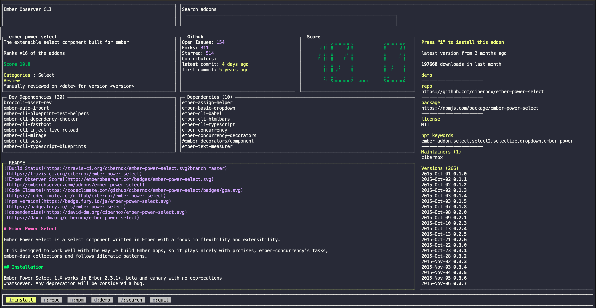

# ember-observer-cli

[](https://github.com/semantic-release/semantic-release)
[](https://npmjs.org/package/ember-observer-cli "View this project on npm")


A CLI for [emberobserver.com](https://emberobserver.com), so now you can install your ember addons from the command-line

[Demo](https://www.youtube.com/watch?v=lHOFc9cW37A)


## Install
```
npm install -g ember-observer-cli
```

## Usage
```
ember-observer-cli
```

You can also use the shorthand version 
```
eoc
```

## Screenshots

### Home


### Addon page


### Search 


### Install addon


## Help
The following keyboard shortcuts can be used in ember-observer-cli

In all the screens
```
q => quit
Tab => Navigate between different parts of the screen
/ => Move focus to search box 
```

In addon info screen
```
i => install the current addon
g => Go to the repository of the addon
d => Go to the demo page of the addon
n => Go to the npm page of the addon
```

